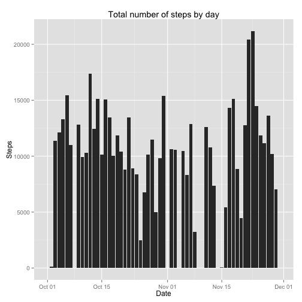
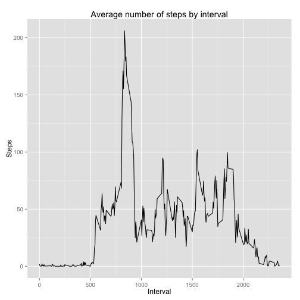
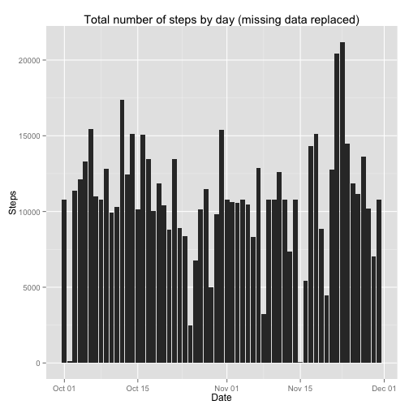
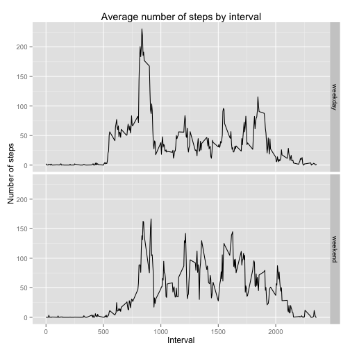

Assignment instructions are marked with *italics*.

## Loading and preprocessing the data

*Load the data.*

```r
stepdata <- read.csv("activity.csv")
```

*Process/transform the data (if necessary) into a format suitable for your analysis.*  
  
Change date format from Factor to Date.  
We leave the interval as int as it is not used for processing.

```r
stepdata$date <- as.Date(stepdata$date, format = "%Y-%m-%d")
```

## What is mean total number of steps taken per day?

*For this part of the assignment, you can ignore the missing values in the dataset.*  
*Make a histogram of the total number of steps taken each day.*  
  
Sum step data by date with missing values removed. Name columns properly. Draw plot.

```r
library(ggplot2)
stepsbydate <- aggregate(stepdata$steps, FUN = sum, by = list(date = stepdata$date), na.rm = TRUE)
colnames(stepsbydate) <- c("date", "steps")
ggplot(data = stepsbydate, aes(x=date, y=steps)) +
    ggtitle("Total number of steps by day") +
    xlab("Date") +
    ylab("Steps") +
    geom_bar(stat="identity")
```

 

*Calculate and report the mean and median total number of steps taken per day.*  
  
Calculate mean and median of the number of steps summed by day, rounded to whole steps.

```r
stepsmean <- round(mean(stepsbydate$steps), digits = 0)
stepsmean
```

```
## [1] 9354
```

```r
stepsmedian <- round(median(stepsbydate$steps), digits = 0)
stepsmedian
```

```
## [1] 10395
```

## What is the average daily activity pattern?

*Make a time series plot (i.e. type = "l") of the 5-minute interval (x-axis) and the average number of steps taken, averaged across all days (y-axis)*  
  
Sum step data by interval with missing values removed. Name columns properly. Draw plot.

```r
stepsbyinterval <- aggregate(stepdata$steps, FUN = mean, by = list(interval = stepdata$interval), na.rm = TRUE)
colnames(stepsbyinterval) <- c("interval", "steps")
ggplot(data = stepsbyinterval, aes(x=interval, y=steps)) +
    ggtitle("Average number of steps by interval") +
    xlab("Interval") +
    ylab("Steps") +
    geom_line(stat="identity")
```

 

*Which 5-minute interval, on average across all the days in the dataset, contains the maximum number of steps?*  
  
Show the interval and steps pair for the interval with the maximum number of steps as averaged across all days.  

```r
stepsbyinterval[stepsbyinterval$steps == max(stepsbyinterval$steps),]
```

```
##     interval    steps
## 104      835 206.1698
```

## Imputing missing values

*Note that there are a number of days/intervals where there are missing values (coded as NA). The presence of missing days may introduce bias into some calculations or summaries of the data.*  
  
*Calculate and report the total number of missing values in the dataset (i.e. the total number of rows with NAs)*  
  
Calculate total number of missing values.  

```r
sum(is.na(stepdata))
```

```
## [1] 2304
```

*Devise a strategy for filling in all of the missing values in the dataset. The strategy does not need to be sophisticated. For example, you could use the mean/median for that day, or the mean for that 5-minute interval, etc.*  
  
Based on the previously shown step distributions by day (total) and by interval (average), activity in an interval seems better estimated by the average of the interval across days than by the average of the day.  
The strategy is hence to replace all missing values for steps with the average number of steps for the corresponding interval.
  
*Create a new dataset that is equal to the original dataset but with the missing data filled in.*  
  
Make a copy of the data set into stepdata2.  
Loop through all 288 (0000 through 2355) time slots and replace NAs with the corresponding step average.

```r
stepdata2 <- stepdata
for (i in 1:288) {
    interval = stepsbyinterval$interval[i]
    steps <- as.numeric(round(stepsbyinterval$steps[i], digits = 0))
    replacements <- length(stepdata2[stepdata2$interval == interval & is.na(stepdata2$steps),1])
    stepdata2[stepdata2$interval == interval & is.na(stepdata2$steps),1] <- rep(steps, replacements)
}
```

*Make a histogram of the total number of steps taken each day and Calculate and report the mean and median total number of steps taken per day.*  
  
Sum step data by interval with missing values removed. Name columns properly. Draw plot.

```r
stepsbydate2 <- aggregate(stepdata2$steps, FUN = sum, by = list(date = stepdata2$date), na.rm = TRUE)
colnames(stepsbydate2) <- c("date", "steps")
ggplot(data = stepsbydate2, aes(x=date, y=steps)) +
    ggtitle("Total number of steps by day (missing data replaced)") +
    xlab("Date") +
    ylab("Steps") +
    geom_bar(stat="identity")
```

 
  
Calculate the mean and median of the number of steps summed by day, rounded to whole steps.

```r
stepsmean2 <- round(mean(stepsbydate2$steps), digits = 0)
stepsmedian2 <- round(median(stepsbydate2$steps), digits = 0)
```
  
Comparison of means and medians.

```r
comparisontable <- matrix(
    c(stepsmean, stepsmean2, stepsmean2 - stepsmean, stepsmedian, stepsmedian2, stepsmedian2 - stepsmedian),
                          ncol=3, byrow = TRUE)
colnames(comparisontable) <- c("Original data", "NAs replaced", "Delta")
rownames(comparisontable) <- c("Mean", "Median")
as.table(comparisontable)
```

```
##        Original data NAs replaced Delta
## Mean            9354        10766  1412
## Median         10395        10762   367
```
  
*Do these values differ from the estimates from the first part of the assignment?*  
*What is the impact of imputing missing data on the estimates of the total daily number of steps?*  
  
The average has increased by 15% while the median has increased by 4%.  

## Are there differences in activity patterns between weekdays and weekends?

*For this part the weekdays() function may be of some help here. Use the dataset with the filled-in missing values for this part.*  
  
*Create a new factor variable in the dataset with two levels ??? ???weekday??? and ???weekend??? indicating whether a given date is a weekday or weekend day.*  
  
Create character variable taking the value "weekday" or "weekend" for every entry.  
Convert character variable to factor for all at once to get the two levels right.

```r
stepdata2$weekday <- rep("weekday", length(stepdata2))
temp <- length(stepdata2$weekday[weekdays(stepdata2$date) == "Saturday" | weekdays(stepdata2$date) == "Sunday"])
stepdata2$weekday[weekdays(stepdata2$date) == "Saturday" | weekdays(stepdata2$date) == "Sunday"] <- rep("weekend", temp)
stepdata2$weekday <- as.factor(stepdata2$weekday)
```

*Make a panel plot containing a time series plot (i.e. type = "l") of the 5-minute interval (x-axis) and the average number of steps taken, averaged across all weekday days or weekend days (y-axis). See the README file in the GitHub repository to see an example of what this plot should look like using simulated data.*  
  
Aggregate step data grouped by interval but also by weekday.  
Drap plot with two facets separating by the weekday variable.

```r
stepsbyinterval2 <- aggregate(stepdata2$steps, FUN = mean, by = list(weekday = stepdata2$weekday, interval = stepdata2$interval), na.rm = TRUE)
colnames(stepsbyinterval2) <- c("weekday", "interval", "steps")
ggplot(data = stepsbyinterval2, aes(x=interval, y=steps)) +
    ggtitle("Average number of steps by interval") +
    xlab("Interval") +
    ylab("Number of steps") +
    facet_grid(weekday ~ .) +
    geom_line(stat="identity")
```

 

